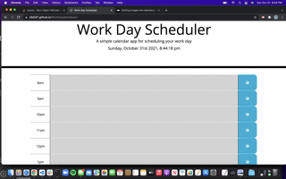

# Work Day Scheduler Starter Code

## Purpose
The purpose of this project was to create a Work Day scheduler for 10 hour work day (8am to 5pm).  You are able to organize your daily tasks by the time they occure.  Using web API's local storage you can save your tasks for that work day.  When a task is coming up the color of the scheduler will change, letting you know of your up coming appointment or task. 

## Built with 
- HTML
- CSS
- Javascript

## Website w Screen Shots 

https://jlib047.github.io/WorkDayScheduler/
## Contribution 
Made with love by Jason Libertelli 